# Hi there 👋 I'm HULUANS

🎓 Graduate Student | ⚛️ Nuclear Engineering | 💻 AI & Agent Developer

I am currently exploring **AI Agents, LLM Applications, Python, RAG, and Software Engineering**.

* 🔭 Currently building AI Agent projects
* 🌱 Learning Python, LLM, RAG, MCP and Agent development
* 🧠 Interested in AI Engineering & Intelligent Systems
* 🚀 Building projects and coding consistently
* 📫 Reach me through GitHub

---

## 🛠 Tech Stack

### Languages


### AI / Data


### Tools


---

## 📊 GitHub Stats

<p align="center">
  
  
</p>
---

## 🔥 GitHub Streak

<p align="center">
  
</p>

---

## 🐍 Contribution Snake

<p align="center">
  <picture>
    <source
      media="(prefers-color-scheme: dark)"
      srcset="https://raw.githubusercontent.com/HULUANS/HULUANS/output/github-contribution-grid-snake-dark.svg"
    />
    <source
      media="(prefers-color-scheme: light)"
      srcset="https://raw.githubusercontent.com/HULUANS/HULUANS/output/github-contribution-grid-snake.svg"
    />
    
  </picture>
</p>

---

## 🚀 Featured Projects

| Project             | Description                                | Tech         |
| ------------------- | ------------------------------------------ | ------------ |
| 🤖 AI Agent         | Building intelligent AI Agents             | Python / LLM |
| 📚 RAG System       | Retrieval-Augmented Generation experiments | Python / RAG |
| 🔌 MCP Demo         | Exploring Model Context Protocol           | Python / MCP |
| 📊 Machine Learning | Data analysis and ML experiments           | Python / ML  |

---

## 🎯 Current Roadmap

```text
AI Agent Engineer Roadmap
│
├── Python
│   ├── Language Fundamentals
│   ├── Async Programming
│   └── Engineering Practices
│
├── LLM
│   ├── Prompt Engineering
│   ├── OpenAI API
│   └── Structured Output
│
├── RAG
│   ├── Embeddings
│   ├── Vector Database
│   └── Retrieval
│
├── Agent
│   ├── Tool Calling
│   ├── Memory
│   ├── Planning
│   └── Multi-Agent
│
├── MCP
│   ├── MCP Server
│   ├── MCP Client
│   └── Tool Integration
│
└── Engineering
    ├── Git / GitHub
    ├── Docker
    ├── Linux
    └── Deployment
```

---

## 🌱 Current Focus

```text
2026
├── Build stronger Python fundamentals
├── Learn LLM application development
├── Build RAG systems from scratch
├── Understand AI Agent architecture
├── Learn MCP
├── Ship real-world AI projects
└── Keep GitHub contributions active
```

---

<p align="center">
  <i>Keep building. Keep learning. Keep shipping.</i>
</p>
